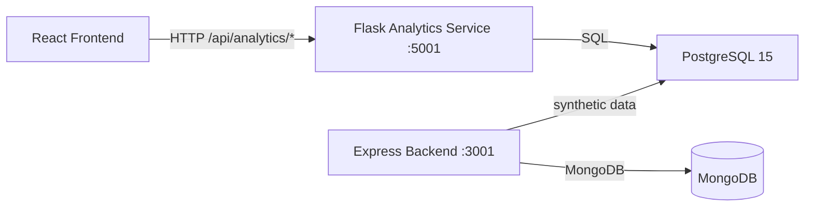

# Analytics Service

**Component ID:** IT22197146

A Flask-based microservice that provides statistical learning-analytics for the AdaptiveMind platform. It ingests student session data from PostgreSQL, performs trend, stability, emotion-correlation, and engagement-performance analyses, and exposes the results via a REST API consumed by the React frontend.

---

## Overview

The Analytics Service is the data-science layer of the R26-IT-097 project. It transforms raw learning-session records into actionable insights for teachers:

- **Trend Analysis** — Is a student improving, declining, or stable over time?
- **Stability Analysis** — Is performance erratic (high variance)? Flag at-risk students.
- **Emotion–LO Correlation** — Which emotions correlate with learning outcomes?
- **Engagement–Performance Comparison** — Do high-engagement sessions produce better scores?

The service sits alongside the main Express/MongoDB backend and is called directly by the React frontend (port 5001).



---

## Features

| Feature | Method | Description |
|---------|--------|-------------|
| **Longitudinal Student Profiling** | SQL aggregation | Per-session LO scores, engagement metrics, and emotion timelines per student |
| **Trend Analysis** | Linear regression (`scipy.stats.linregress`) | Classifies trajectory as *improving*, *declining*, *stable*, or *unstable* |
| **Stability Analysis** | Variance, SD, CV | Detects erratic performers; flags at-risk students against class baseline |
| **Emotion–LO Correlation** | Pearson r (`scipy.stats.pearsonr`) | Correlates 7 emotion labels with learning-outcome scores |
| **Engagement–Performance Comparison** | Mann-Whitney U (`scipy.stats.mannwhitneyu`) | Compares high- vs low-engagement session scores with effect size |

---

## Technology Stack

| Layer | Technology |
|-------|------------|
| Language | Python 3.9+ |
| Web Framework | Flask 3.0.3 + Flask-CORS 4.0.1 |
| Database | PostgreSQL 15 |
| DB Driver | psycopg2-binary 2.9.9 |
| Data Processing | pandas 2.2.2, numpy 1.26.4 |
| Statistics | scipy 1.13.1, scikit-learn 1.5.0 |
| Visualization | matplotlib 3.9.0 |
| Testing | pytest 8.2.2, pytest-cov 5.0.0 |
| Environment | python-dotenv 1.0.1 |

---

## Installation & Setup

### Prerequisites

- Python 3.9+
- PostgreSQL 15 (local or Docker)
- Docker & Docker Compose (recommended)

### 1. Start PostgreSQL

Using Docker Compose (from project root):

```bash
cd ..
docker compose up -d postgres
```

Or use a local PostgreSQL instance.

### 2. Configure Environment Variables

The service reads from the root `.env` file. Ensure these variables are set:

```env
# --- Analytics Service Database (PostgreSQL) ---
ANALYTICS_DB_HOST=localhost
ANALYTICS_DB_PORT=5432
ANALYTICS_DB_NAME=adaptive_learning_analytics
ANALYTICS_DB_USER=postgres
ANALYTICS_DB_PASSWORD=your_password
```

### 3. Create Database & Schema

```bash
cd analytics-service
python setup_db.py
```

This creates the `adaptive_learning_analytics` database and applies `models/schema.sql`.

### 4. Install Python Dependencies

```bash
pip install -r requirements.txt
```

### 5. Generate Synthetic Data

Populate the database with 20 students, 10 sessions each:

```bash
python -m utils.data_generator
```

---

## Usage

### Running the Service

```bash
cd analytics-service
python app.py
```

The API will be available at `http://localhost:5001`.

### API Endpoints

| Method | Endpoint | Description |
|--------|----------|-------------|
| `GET` | `/api/analytics/health` | Health check + DB connectivity |
| `GET` | `/api/analytics/students` | List all student IDs |
| `GET` | `/api/analytics/student/{id}/profile` | Full profile + session list |
| `GET` | `/api/analytics/student/{id}/trend` | Trend analysis (regression) |
| `GET` | `/api/analytics/student/{id}/stability` | Stability metrics + at-risk flag |
| `GET` | `/api/analytics/student/{id}/emotions` | Emotion–LO correlations |
| `GET` | `/api/analytics/student/{id}/engagement` | Engagement comparison (Mann-Whitney) |
| `GET` | `/api/analytics/student/{id}/complete` | All 4 analyses combined |

### Example API Calls

**Health check:**

```bash
curl http://localhost:5001/api/analytics/health
```

**List students:**

```bash
curl http://localhost:5001/api/analytics/students
```

**Trend analysis for STU_001:**

```bash
curl http://localhost:5001/api/analytics/student/STU_001/trend
```

**Complete analytics:**

```bash
curl http://localhost:5001/api/analytics/student/STU_001/complete
```

**Example response (`/complete`):**

```json
{
  "student_id": "STU_001",
  "trend": {
    "student_id": "STU_001",
    "num_sessions": 10,
    "regression_stats": {
      "slope": 2.35,
      "intercept": 52.1,
      "r_value": 0.94,
      "p_value": 0.0001,
      "std_err": 0.28,
      "r_squared": 0.8836
    },
    "trend_classification": "improving",
    "interpretation": "This student shows a statistically significant improving trend..."
  },
  "stability": {
    "student_id": "STU_001",
    "variance": 18.5,
    "sd": 4.30,
    "cv": 5.8,
    "mean": 74.2,
    "num_sessions": 10,
    "at_risk": false,
    "interpretation": "Performance is stable."
  },
  "emotions": {
    "student_id": "STU_001",
    "num_sessions": 10,
    "correlations": {
      "happy": { "r": 0.65, "p_value": 0.04, "significant": true, ... }
    }
  },
  "engagement": {
    "student_id": "STU_001",
    "mann_whitney": { "U_statistic": 85.0, "p_value": 0.02, "significant": true },
    "effect_size": 0.45,
    "descriptive_statistics": { ... }
  }
}
```

---

## Project Structure

```
analytics-service/
├── app.py                          # Flask REST API (8 endpoints)
├── requirements.txt                # Python dependencies
├── setup_db.py                     # Database creation + schema bootstrap
│
├── config/
│   ├── __init__.py
│   └── database.py                 # psycopg2 connection pool + cursor context manager
│
├── models/
│   └── schema.sql                  # PostgreSQL DDL (5 tables, indexes)
│
├── services/
│   ├── trend_analyzer.py           # Linear regression + trend classification
│   ├── stability_analyzer.py       # Variance-based stability + at-risk flagging
│   ├── emotion_correlator.py       # Pearson correlation (emotion vs LO)
│   └── engagement_comparator.py    # Mann-Whitney U + effect size
│
├── utils/
│   ├── __init__.py
│   └── data_generator.py           # Synthetic data generator (20 students, Faker)
│
└── tests/
    ├── conftest.py                 # Shared pytest fixtures
    ├── test_trend_analyzer.py      # 35 tests (regression, classification, viz)
    ├── test_api.py                 # 28 tests (endpoints, CORS, errors)
    ├── test_database.py            # 14 tests (pool, cursor, transactions)
    ├── test_emotion_correlator.py  # Emotion correlation tests
    ├── test_engagement_comparator.py # Mann-Whitney tests
    └── test_stability_analyzer.py  # Stability analysis tests
```

---

## Testing

### Run All Tests

```bash
cd analytics-service
python -m pytest tests/ -v
```

### Run with Coverage

```bash
python -m pytest tests/ --cov=. --cov-report=term-missing --cov-fail-under=75
```

### Current Coverage

| Module | Coverage |
|--------|----------|
| `app.py` | 69% |
| `config/database.py` | 92% |
| `services/trend_analyzer.py` | 86% |
| `services/stability_analyzer.py` | 85% |
| `services/emotion_correlator.py` | 88% |
| `services/engagement_comparator.py` | 92% |
| **Total** | **79%** |

### Run Individual Test Files

```bash
python -m pytest tests/test_trend_analyzer.py -v
python -m pytest tests/test_api.py -v
python -m pytest tests/test_database.py -v
```

---

## Integration with Main Project

### Data Flow: MongoDB → PostgreSQL

1. The main **Express backend** stores users and auth data in **MongoDB**.
2. The **`utils/data_generator.py`** script creates synthetic student profiles, sessions, LO scores, emotions, and engagement metrics in **PostgreSQL**.
3. In production, a data-pipeline job (or the Express backend) would mirror relevant MongoDB student records into PostgreSQL for analytics.

### Frontend → Analytics API

The React frontend calls the analytics service directly:

```javascript
// frontend/src/lib/api.js
const ANALYTICS_BASE_URL = "http://localhost:5001/api/analytics";

const analyticsApi = {
  getStudentComplete: (studentId) =>
    fetch(`${ANALYTICS_BASE_URL}/student/${studentId}/complete`),
};
```

The **Teacher Dashboard** renders analytics via:
- [`StudentAnalytics.jsx`](../frontend/src/components/StudentAnalytics.jsx) — Main dashboard
- [`TrendChart.jsx`](../frontend/src/components/TrendChart.jsx) — Recharts line chart
- [`StabilityCard.jsx`](../frontend/src/components/StabilityCard.jsx) — Variance metrics

### Monorepo Scripts

From the project root:

```bash
# Run analytics service only
npm run dev:analytics

# Run frontend + backend + analytics concurrently
npm run dev:all
```

---

## Database Schema

### Tables

1. **`student_profiles`** — Student directory (natural key `student_id` from MongoDB)
2. **`learning_sessions`** — Per-session metadata (lesson, duration, timestamps)
3. **`lo_achievement_scores`** — Learning-outcome scores by Bloom's taxonomy level
4. **`emotional_states`** — Emotion snapshots per session (from IT22140784)
5. **`engagement_metrics`** — Per-session engagement score and interaction counts

See [`models/schema.sql`](models/schema.sql) for full DDL.

---

## License

Internal academic project — R26-IT-097.
